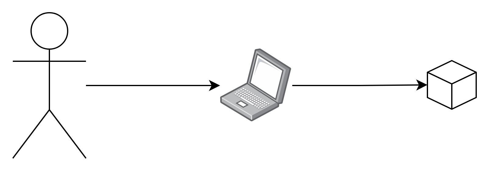
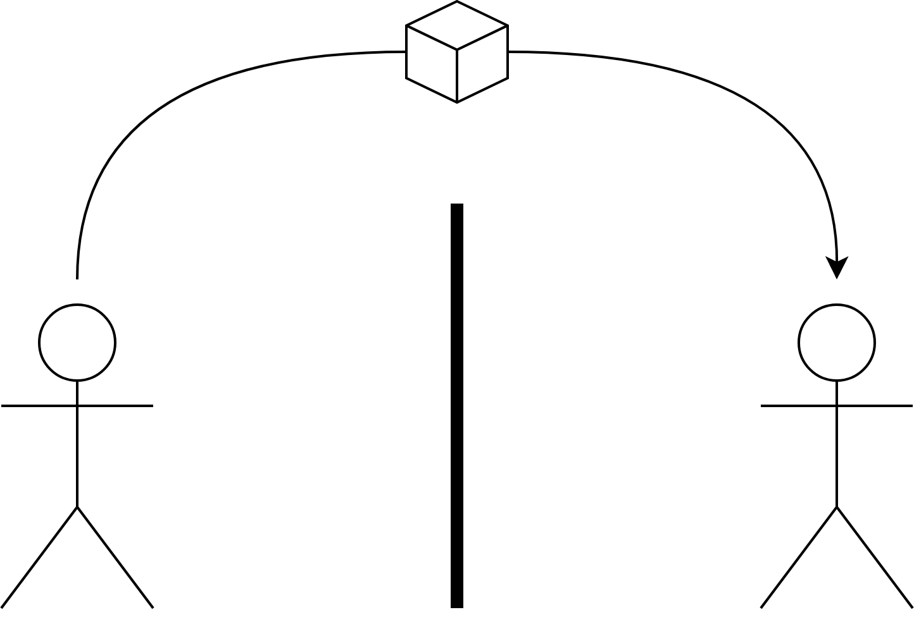
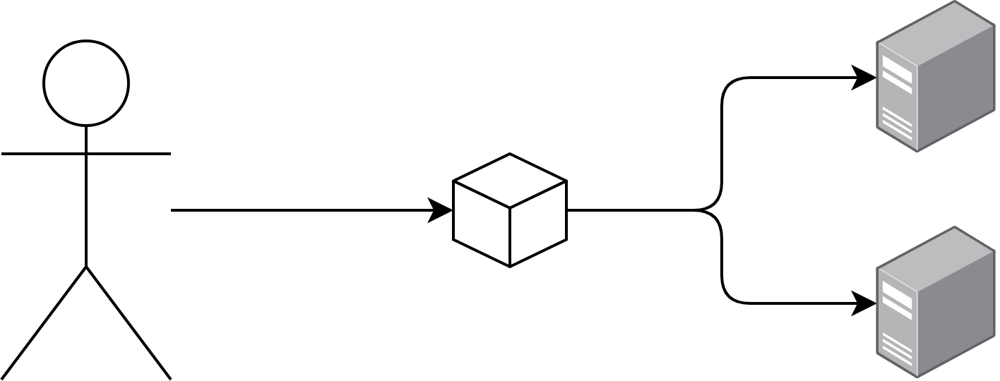
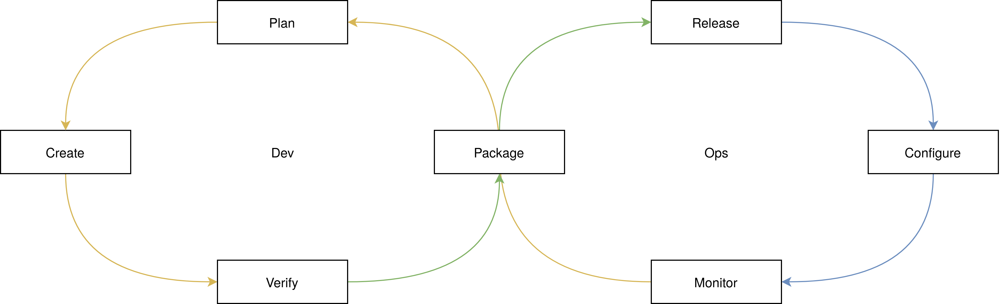

## Agenda

- Traditional Scenario
- DevOps Scenario
- Phases and Track Content

---

## Traditional Scenario

---

## Develop

---

## Throw

{ width=50% }

---

## Operate

---

## DevOps Scenario

---

## Mindset

> you built it, you run it

---

## Knowledge

---

## Automation

{ width=50% }

---

## Phases and Track Content

---

## Plan Phase

- Define, Track and Prioritize Tasks

---

## Plan Content

- Agile

---

## Create Phase

- Design and Develop Code
- Create Project Data

---

## Create Content

- Tooling around Programming Languages
- Productive Git
- Basic System Design
- Network Fundamentals

---

## Verify Phase

- Automated Quality Assurance

---

## Verify Content

- Testing Fundamentals
- Continuous Integration
- Introduction to GitHub Actions
- Introduction to Jenkins

---

## Package Phase

- Produce Product

---

## Package Content

- Continuous Delivery
- Introduction to Nexus

---

## Release Phase

- Bring Product to Customers

---

## Release Content

- Where to Deploy?
- Introduction to ProxMox Virtual Environment
- Introduction to Podman
- Introduction to Kubernetes
- Introduction to AWS

---

## Configure Phase

- Manage Infrastructure of Product

---

## Configure Content

- Server Configuration
- Infrastructure as Code
- Introduction to Ansible
- Introduction to OpenTofu

---

## Monitor Phase

- Track Metrics and Errors

---

## Monitor Content

- Observability
- Introduction to Prometheus
- Introduction to Grafana
- Introduction to Alertmanager
- Introduction to Tempo
- Introduction to Loki
- Site Reliability Engineering
