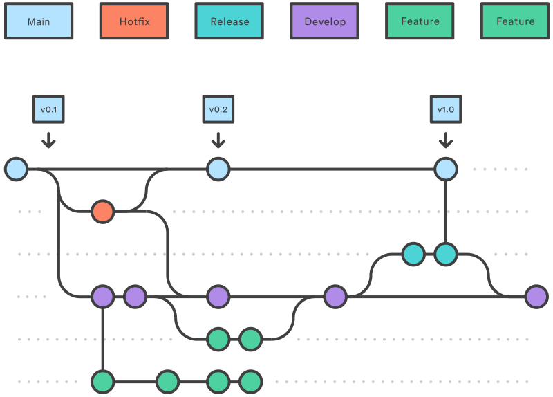

## Agenda

- Branching Strategies
- Pull Requests
- Merge Conflicts
- Resetting and Reverting
- Conventional Commits
- Commit Signing
- Git Hooks

---

## Branching Strategies

---

## Git Flow



---

## Trunk Based Development


---

## Pull Requests

- Notify about finished Changes
- Review Code
- Discuss Implementation 

---

## Merge Conflicts 

---

## What are Merge Conflicts?

- Occur when Merging or Rebasing
- Changes at the same Place
- Choose the correct combination Changes

---

## Example Initial Code

```python
def greet(name: str) -> str:
    return "Hello" + name + "!"
```

---

## Example Remote Code

```python
def greet(name: str) -> str:
    return "Hello {}!".format(name)
```

---

## Example Local Code

```python
def greet(name: str) -> str:
    return f"Hello {name}!"
```

---

## Example Conflict

```python
def greet(name: str) -> str:
    return "Hello {}".format(name)
```

---

## Resetting and Reverting

---

## What is the difference?

- Remove existing Commits
- Add new Commit undoing Changes

---

## Example Commits

```bash
git log
```

```
197324
249321
342132
```

---

## Example Resetting

```bash
git reset 249321
git log
```

```
249321
342132

```

---

## Example Reverting

```bash
git revert 249321
git log
```

```
128412
197324
249321
342132
```

---

## Conventional Commits

---

## What are Conventional Commits?

- Convention for Commit Messages
- Automated Changelogs
- Automated Version Tagging
- Improved Commit Exploring

---

## Format

```
<type>[optional scope]: <description>

[optional body]

[optional footer(s)]
```

---

## Example Commit Messages

> feat(api): add 2FA

> chore!: drop support for Internet Explorer 

> docs: update README

---

## Commit Signing

---

## What is Commit Signing

- Verifying & Signing Commits
- Know who did Commit 
- Inform that you did Commit

---

## How to Sign and Verify Commits?

- GPG Key
- SSH Key
- Git Config

---

## Git Hooks

---

## What are Git Hooks?

- Scripts that run during different Git commands
- Automate usual manual Workflows

---

## When can I execute Git Hooks?

- pre-commit
- commit-msg
- post-commit
- post-checkout
- pre-push
- ...

---

## How to add Git Hooks?

```bash
cat pre-commit
```

```bash
npm run format
npm run lint
```

```bash
cp pre-commit .git/hooks
```
