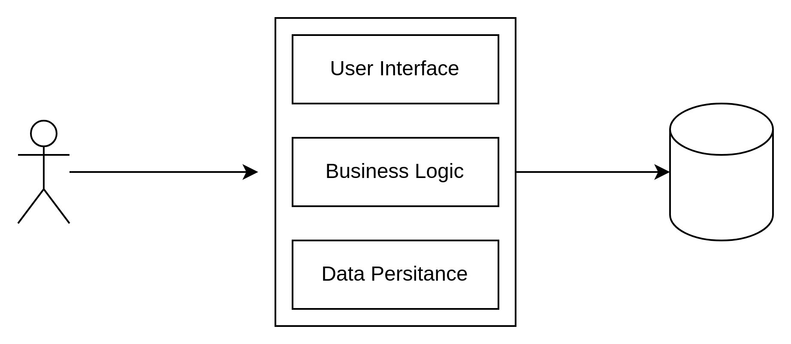
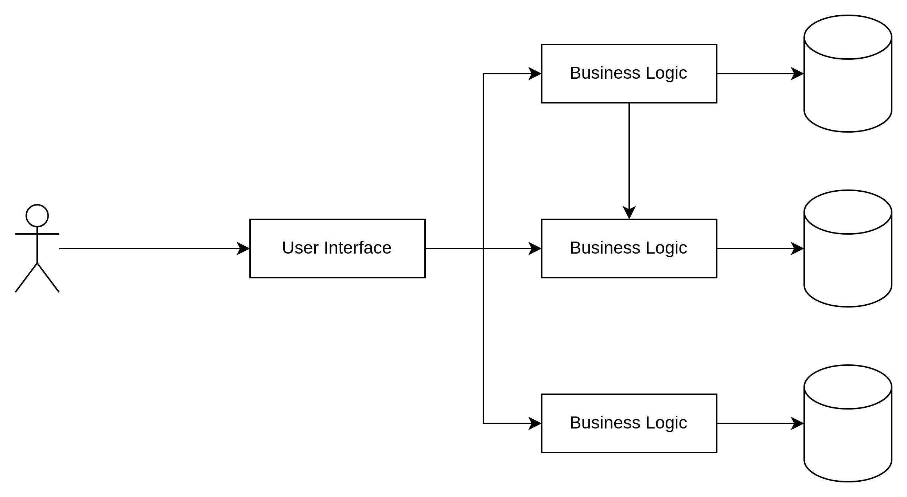
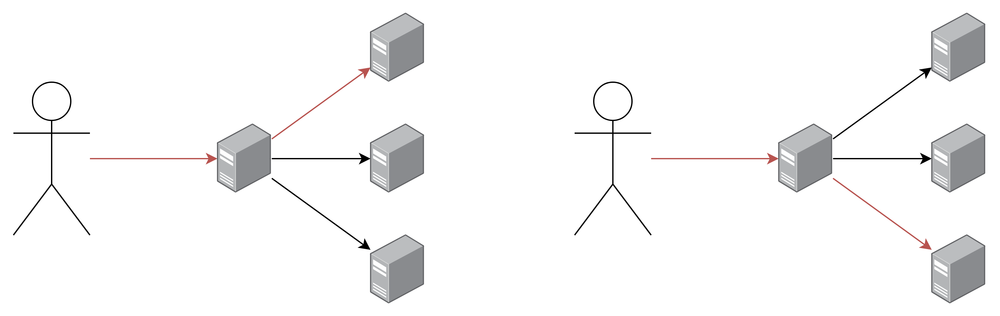
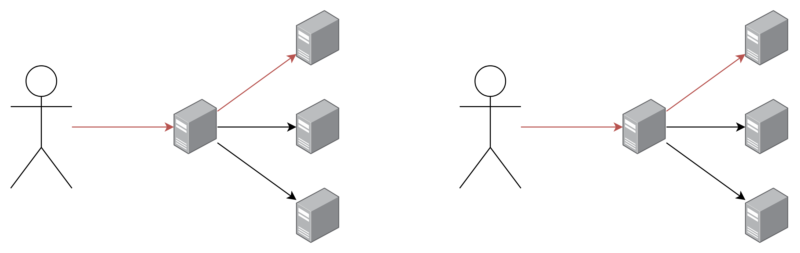
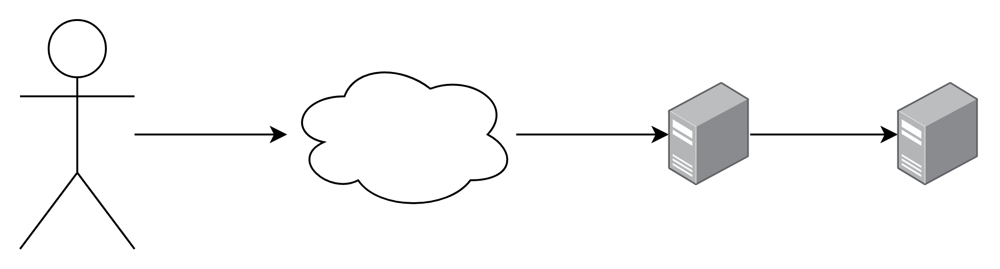
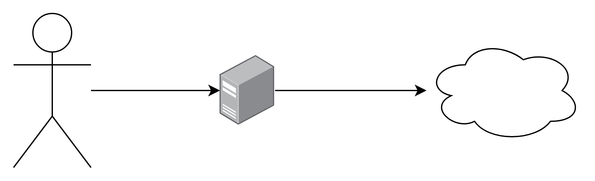
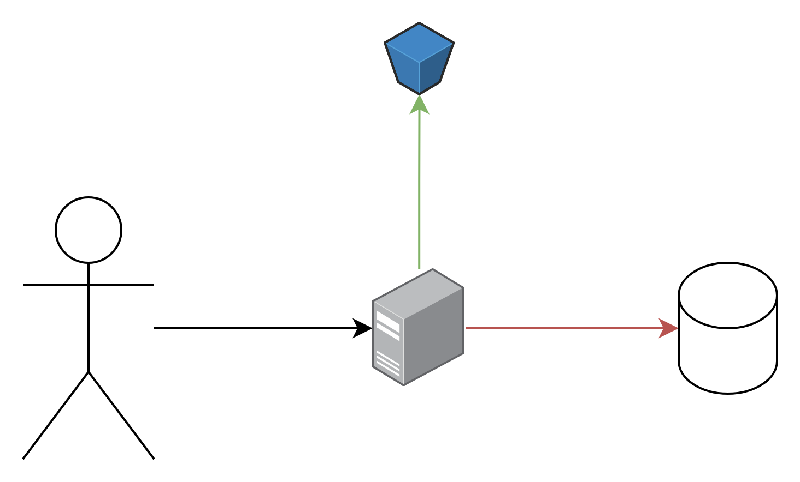
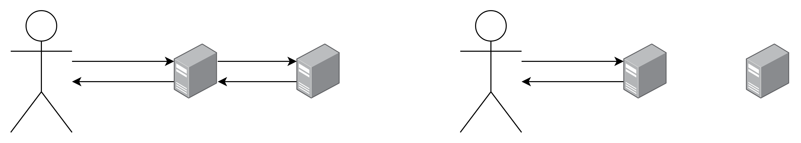
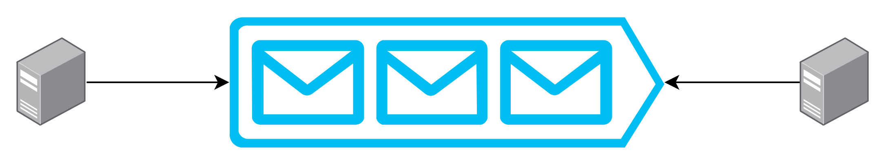

## Agenda

- Monolith vs Micro Services
- Stateful vs Stateless
- Vertical vs Horizontal Scaling
- Load Balancing
- Proxies
- Persistence
- Caching
- Rate Limiting
- Queues

---

## Monolith vs Micro Services

<aside class="notes">
    Lets start with the difference between monoliths and micro services.
</aside>

---

## What is a Monolith

- The complete Application Logic in one Service
- Single Point of Failure
- One Large Codebase
- Traditional but Effective

<aside class="notes">
    A monolith application contains the complete application logic in a single
    instance. This covers the user interfaces that delegates to the business
    logic which interacts with the data access layer. Or in other words from
    the user actions it decides which actions to take and then what has to be
    applied on the database. The problem with that is that in case there is a
    failure in any of the components the whole application will fail. This is
    also know as single point of failure. These applications have one large code
    base that contains everthing related to the application. It is the
    traditional way to create applications as it is easy and effective. But it
    has some drawbacks related to scaling. But we will get to that.
</aside>

---

## Example of a Monolith

---

## What are Micro Services

- Logic of an Application split into multiple Services
- Logic Specific Codebase
- Independence

<aside class="notes">
    Instead of having all the logic in a single instance in micro services it is
    split into different small applications that do just a specific thing. In
    case that one of them breaks the rest of the application is able to continue
    working. As the microservies only do a really specific thing their code base
    is smaller an only specific to them. Because of that there can be teams
    focusing on a single small service and have independence as long as they
    comply with the agreement they made with other teams. Because in the end
    some microservices work together. 
</aside>

---

## Example of Micro Services

---

## Stateful vs Stateless

<aside class="notes">
    As we mentioned before there are some drawbacks to either using monoliths or
    microservices in terms of scalability. To properly understand this you have
    to understand the difference between stateful and stateless applications.
</aside>

---

## What is Stateful

- Service keeps track of Information (State)
- Mostly used with Monoliths

<aside class="notes">
    Stateful applications keep track of the things they have been working with.
    For example the users that have logged in or items in a shopping cart or how
    much heart points your current character in a game has. They use databases
    to persist information but keep an in memory state on the server that is
    required to process requests. Monoliths mostly are stateful but not always. 
</aside>

---

## What is Stateless

- Service requires all the Information from Client
- Mostly used in Micro Services

<aside class="notes">
    So what is stateless then? Stateless applications require all the
    information from the client to process requests. So for example in a
    messaging service the client will have to provide where they want to send
    the message to, what the content of the message should be and who they are.
    Stateless applications still interact with databases but do not keep
    information on the server. Because microservices are split around into
    different parts they mostly are stateless and receive all the information
    required from either the client or an other microservice.
</aside>

---

## Vertical vs Horizontal Scaling

<aside class="notes">
    Now lets come to the part of scaling. There are two common ways to scale
    applications either vertically or horizontally. Lets checkout the
    differences.
</aside>

---

## Vertical Scaling

- Add more Power
- Increase Server Resources (CPU, Memory, Storage, etc.)
- Requires downtime
- Single point of failure
- Limited
- Can be done for Stateful and Stateless

<aside class="notes">
    When scaling vertically you can think of increasing the server size or
    adding more power. This means adding CPU, Memory, Storage or whatever is
    missing. A downside of that is that it mostly requires downtime for your
    server to have the new components. In case of the components breaks the
    server is a single point of failure again meaning that the whole application
    will go down. Another things is that machines have limits on how many
    resources they can use so you could run into this problem one day.
</aside>

---

## Horizontal Scaling

- Add more Servers
- No downtime
- Requires a Load Balancer
- Can be easily done for Stateless
- Can be done with loads of work for Stateful

<aside class="notes">
    On the other hand there is horizontal scaling which you can think of as just
    adding more servers. This requires no downtime but it requires a load
    balancer infront of your servers. We will cover what a load balancer is in
    just a second. This approach of scaling can easily be done for stateless
    workloads but not that easily for stateful ones.
</aside>

---

## Load Balancing

<aside class="notes">
    As just mentioned load balancing is used for scaling. But what is it? 
</aside>

---

## What is Load Balancing?

- Distributing load of Service across multiple Instances
- Stateless Applications
- Sticky Sessions

<aside class="notes">
    Load balancing is used to distribute the load amongst different servers.
    Meaning that a request that goes to a load balancer will end up on one of
    the servers the load balancer maps to. This behaviour can easily be used for
    stateless applications. For stateful applictions it requires a concept
    called sticky sessions. Lets look at both of them.
</aside>

---

## Stateless Load Balancing

<aside class="notes">
    As you can see there is a server between the main servers. On the first
    request it sends the request to the upper server. On the second request it
    sends it to the lower one. Servers can easily be added and the load balancer
    will take care of it.
</aside>

---

## Sticky Session Load Balancing

<aside class="notes">
    For the sticky session load balancing there is also a server between the
    main serves. On the first request it sends the request to one of the servers
    randomly and keeps track of the fact that the user has already been
    connecting to this server. On the second request the load balancer knows the
    client already and sends the request to the correct server.
</aside>

---

## Proxies

<aside class="notes">
    Another thing that is oftenly used are proxies. But these are more oftenly
    seen in your CI/CD environment or on your work PC. Sometimes they are used
    to link to different services from the same one.
</aside>

---

## What is a Proxy?

- Server between you and the Internet or a Service
- Privacy, Performance and Security Improvement
- Reverse or Forwarding Proxies

<aside class="notes">
    But what is a proxy? It is a server that stands between you and the internet
    or another service. It is used to provide more privacy by having all
    requests come from the same server and removing confidential data. It can
    also be used to optimise performance by caching requests that have been
    done. We will cover caching soon. Also they are used for increased security
    by blocking requests to blocked websites, detecting malware or stolen data.
    Generally there are two types of proxies reverse and forwarding proxies.
    Lets look at the difference.
</aside>

---

## Reverse Proxy

<aside class="notes">
    When you reach a service over the internet it is sometimes hidden behind a
    reverse proxy that forwards your request to the internal network. In this
    example the first server is the proxy and the one next to it the server.
    Reverse proxies are mostly used with applications.
</aside>

---

## Forwarding Proxy

<aside class="notes">
    In bigger companies when you want to connect to the internt your requests
    will mostly go through a proxy that will take care of the previously
    mentioned things before sending the request into the internet.
</aside>

---

## Persistence

<aside class="notes">
    Now let us take a look at persitance. Or in other words how your application
    can store/persist data.
</aside>

---

## How can I persist Data?

- In Memory
- File Storage
- Databases

<aside class="notes">
    The most common ways used to persist data are either in memory, in files or
    databases. But what does this mean?
</aside>

---

## In Memory

- Data is stored in Memory 
- Data is lost on Shutdown

<aside class="notes">
    With in memory persitance the data is written to RAM but only as long as
    your device or application is turned on. As soon as it turns off the data
    will be lost. This is generally used for state or testing purposes.
</aside>

---

## File Storage

- Data is stored on disk 
    - on a single machine 
    - on multiple machines 
    - on multiple machines in different locations

<aside class="notes">
    Another way you can store data is with the help of files. The data will
    persist as long as the files existing. These files can either be on the
    machine that your application is running on. On multiple machines in the
    same location or even different locations. Depending on how important the
    data is.
</aside>

---

## Database

- Collection of (un)structured Data
- Allows to analyze the Data

<aside class="notes">
    The most used way of persistance are databases. Databases contain a
    collection of either structured or unstructured data. This depends on your
    kind of database. Databases allow you to analyze data and query the data
    stored. That is why applications mostly use database for their data.
</aside>

---

## Caching

<aside class="notes">
    Lets get to caching. 
</aside>

---

## What is Caching?

- Temporarily storing important Data
- Improves Performance
- Mostly done with In Memory Storage

<aside class="notes">
    So what is caching? Caching is used to temporarly store important data. With
    important data we mean data that will propably be access again quite soon.
    This is in most cases done with in memory storage as it allows to quickly
    retrieve the data.
</aside>

---

## Caching Example

<aside class="notes">
    Lets take a look at an example. If the client makes a request to retrieve
    some data the application will first check if it is contained within the
    cache. If yes it can retrieve it from the cache (green arrow) and provide a
    fast answer. Else it will have to query for the data and be a bit slower.
</aside>

---

## Rate Limiting

<aside class="notes">
    Another thing that is implemented in applications that retrieve a lot of
    traffic is rate limiting.
</aside>

---

## What is Rate Limiting?

- Blocking users that over use a Service
- Mostly done based on amount of Requests

<aside class="notes">
    But what is rate limiting? Rate limiting is used to block users that over
    use an application. Over use can be defined in different ways. It can be the
    amount of requests or the total burst size of this service.
</aside>

---

## Rate Limiter

<aside class="notes">
    Lets take a look at an example in the first request the user is able to
    access the server. After some time the user over used the service or the
    burst limit is hit and the ratelimiter will respond with HTTP code 429. As
    the ratelimiter does not have to do as much processing on the requests as
    the service itself it is able to handle all the load.
</aside>

---

## Queues

<aside class="notes">
    The last thing we look at are queues. 
</aside>

---

## What are Queues?

- Systems that line up Data
- First in, first out
- Asynchronous
- Different Topics
- Producers and Consumers

<aside class="notes">
    But what are queues. In a nutshell it is a system that lines up the data
    that it receives in order of the requests that came in. Or in other words
    first in, first out. This allows for different services to work
    asynchronously by publishing data onto a topic and then another service at
    any time to pull some data from the same topic. These two roles are called
    producer and consumer.
</aside>

---

## Queue Example

<aside class="notes">
    In praxis this looks like this. The service on the left side produces some
    data and it gets added to the queue. In this picture this is visualized as
    a letter. The other service on the right side is then able to pull data as
    soon as there is time.
</aside>
