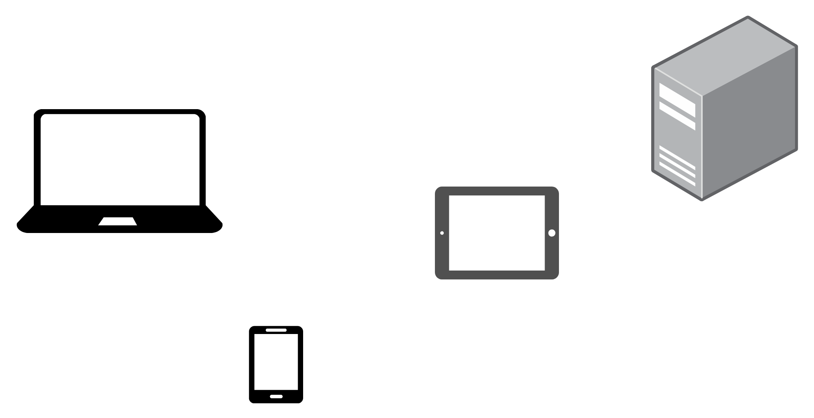
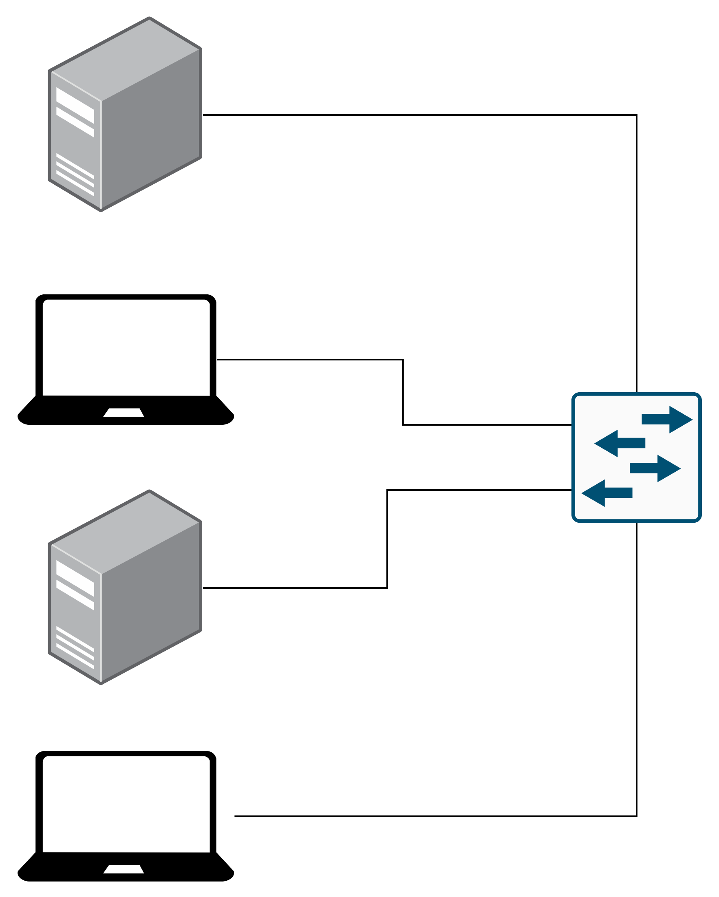
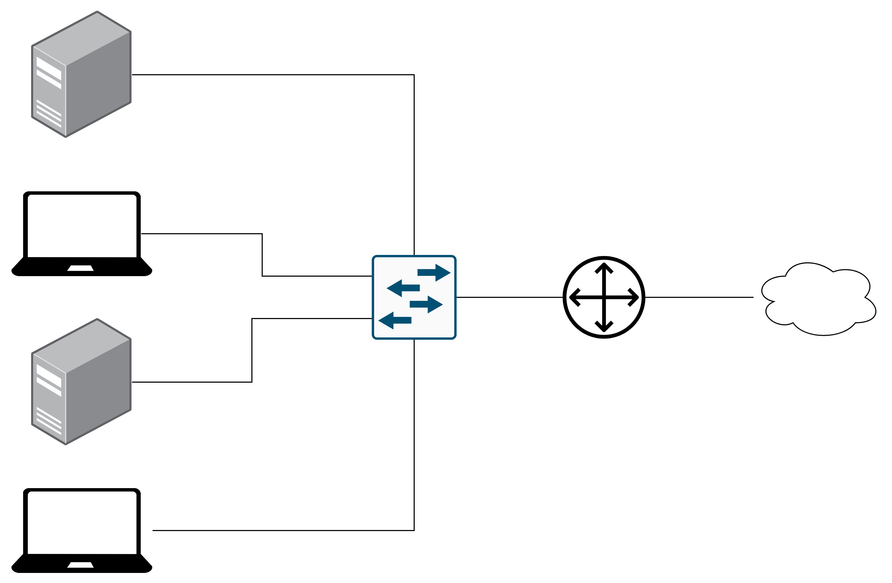
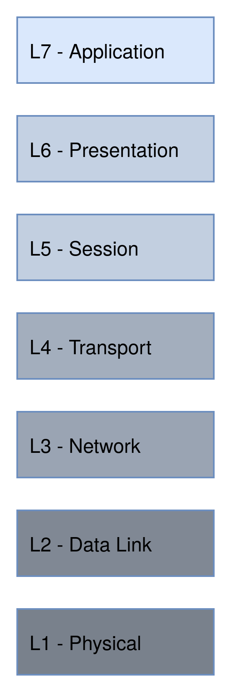
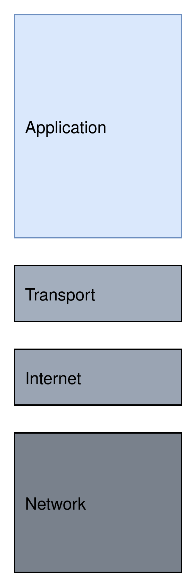
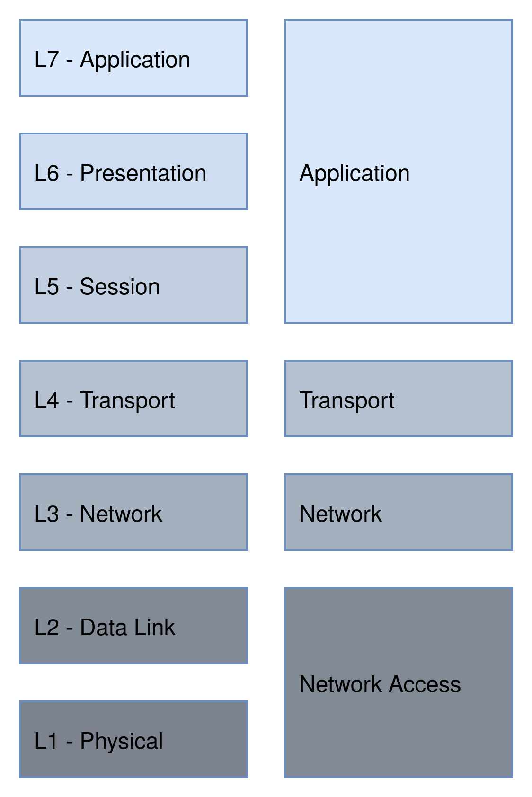

## Agenda

- Basic Terms
- OSI and TCP/IP Model
- Protocols
- Advanced Topics 

---

## Basic Terms

---

## Client

---

## MAC Address

- 12 Character Number assigned to each Client
- Used to address local Clients over Wire or Wireless
- Can usually be changed manually

---

## IP Address

- Two Version 4 and 6
- 32 or 128 Bit
- Used to address Clients
- Can be changed within the local Network
- Mostly fixed for public IP address

---

## Switch

{ width=40% }

---

## Router

{ width=70% }

---

## OSI and TCP/IP Model

---

## OSI Model

{ width=20% }

---

## TCP/IP Model

{ width=20% }

---

## OSI vs TCP/IP Model

{ width=40% }

---

## Protocols

---

## Address Resolution Protocol (ARP)

- Maps MAC to IP Address
- Local Cache of Mapping
- Request for missing Items
- Data Link or Network Access Layer

---

## Transmission Control Protocol (TCP)

- Protocol for delivering Messages
- Reliable, Ordered and Error Checked
- Transport Layer

---

## User Data Protocol (UDP)

- Protocol for delivering Messages
- Shoot and Forget, Fast
- Transport Layer

---

## File Transfer Protocol (FTP)

- Used to transfer Files
- Application Layer
- Port 21

---

## Secure Shell (SSH)

- Securely access Computer over insecure Network
- Application Layer
- Port 22

---

## Dynamic Host Configuration Protocol (DHCP)

- Automate Network Configuration of Service
- Network and Data Link or Network and Network Access Layer
- Port 67

---

## Domain Name System (DNS)

- Map IP Address to Hostname
- Application Layer
- Port 53

---

## Hypertext Transfer Protocol (HTTP)

- Used to transfer and interact with Media
- Application Layer
- Port 80

---

## Routers and Firewalls

---

## Routing

- How to reach other Network

---

## Rules

- IPs
- Ports
- Protocol
- Dangerous Traffic 

---

## VPN

- Secure Connection over insecure Network
- Encryption
- Hide private Information
- Access internal Resources
