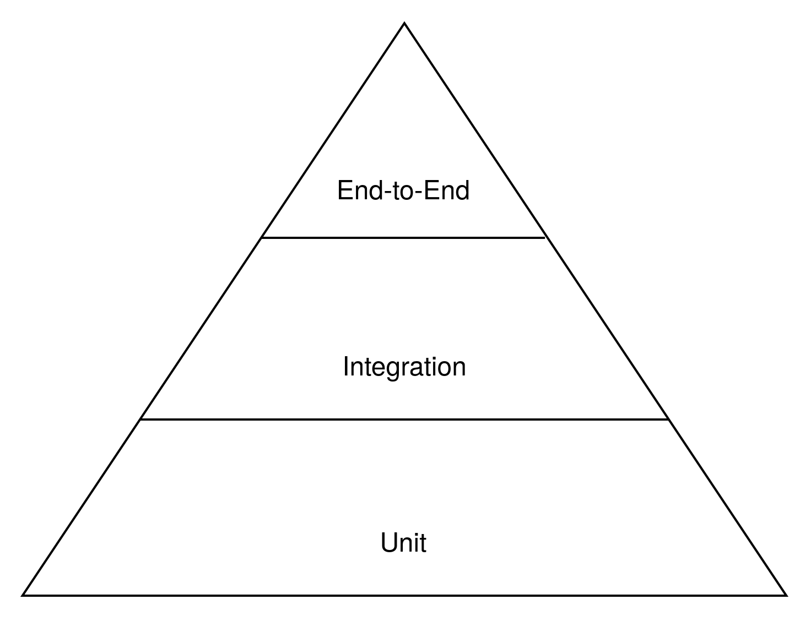

## Agenda

- Purpose 
- Categories
- Testing Pyramid

---

## Purpose 

- Identify Errors and Bugs
- Check Requirements

---

## Categories

---

## Functional

---

## Functional Testing Types

- Unit
- Integration
- End-to-End
- ...

---

## Non-Functional

---

## Non-Functional Testing Types

- Load
- Usability
- Performance
- ...

---

## Testing Pyramid

{ width=75% }
