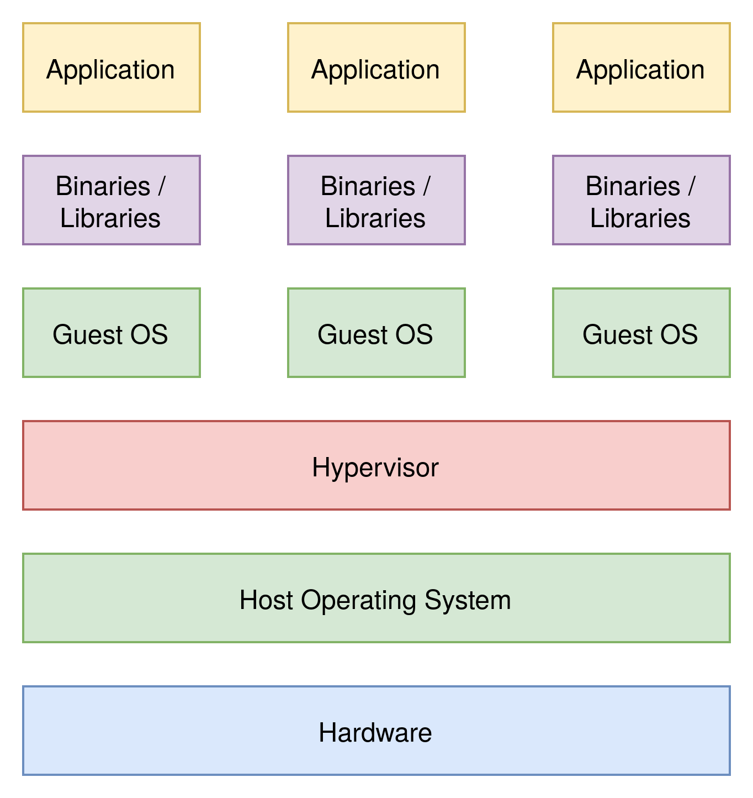

## Agenda

- On Premise vs Cloud
- Server
- Virtual Machines
- Container

---

## On Premise vs Cloud

---

## On Premise

- Data Center of Company
- High Costs
- Maintenance
- Control over Data

---

## Cloud

- Data Centers of Provider
- Cost Reduction (mostly)
- Security
- Reliability
- Vendor Lock-In
- No Control over Data

---

## Server

- Single Application on one Server
- Unused Resources
- Not easily Scalable

---

## Server Example

{ width=75% }

---

## Virtual Machines

- Multiple Applications on one Server
- Separated through virtualized Operating Systems
- Better Resource Usage
- Performance Overhead
- Complexity

---

## Virtual Machines Example

{ width=50% }

---

## Container

- Multiple Applications on one Server
- Separated through Containers
- Optimal Resource Usage
- Complexity

---

## Container Example

{ width=50% }
