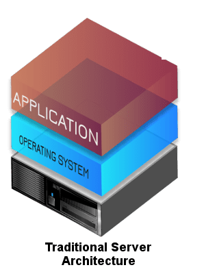
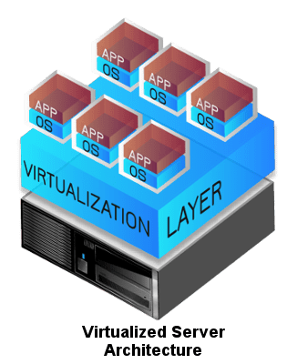
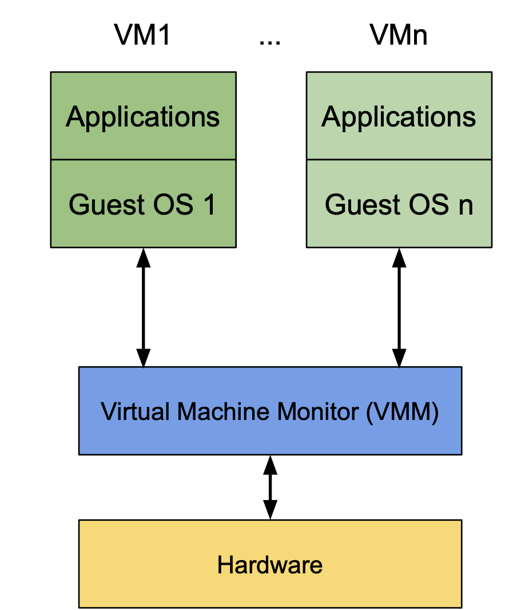
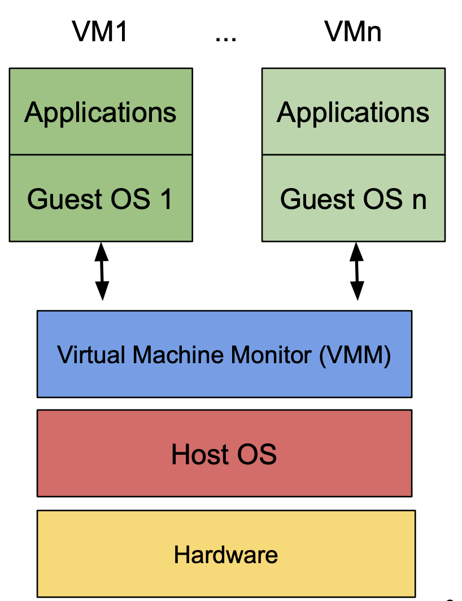

## Agenda

- What was before?
- What is solved?
- Types of virtualization
- Create your first VM with QEMU
- ...

---

## What was before?
 



**Note:** https://www.nestitsolution.com/services/it-infrastructure/virtualization/

---

## What is solved



---

## Basic conepts
- Abstraction to detach logical resources from a physical resource pool 
    - “Behave (nearly) the same but are not (the same)”
- Forms of abstraction: Simulation vs. Emulation vs. Virtualization 
- Simulation (one definition)
    - Model of the actual system, no direct link to actual system, no implementation of actual system specification
- Emulation (one definition)
    - Implementation that approximates the behavior of the actual system, but its
    implementation is not necessarily based on the implementation of the actual system
- Virtualization (one definition)
    - Implementation that approximates the behavior of the actual system by using parts of or the entire implementation of the actual system
- Mind: Delineation not always distinct, precise, and consistent, various hybrid forms exist

---

## Types of virtualization

There are two types of virtualization
- Type I
    - HW + VMM + Guest operating system
    - Runs on top of the host's hardware
    - Known as Baremetal Hypervisors
    - Solutions: VMWare ESX and ESXi, Microsoft Hyper-V
    
- Type II
    - HW + HOS + VMM + Guest operating system
    - Runs on thop of the host's operating system
    - Solutions: Oracle VM VirtualBox, Microsoft Virtual PC
    - 
---

## Full-Virtualization (aka HVM) vs Para-Virtualization

- Full Virtualization
    - Complete virtualization of the underlying hardware
        - Type I and II
    - Unmodified Operating System supported
- Para-Virzualization
    - Not fooling the guest operating system and tell it that it is a VM
    - Needs a new intervace on the VMM to directly access Hardware features (Hypercall interface)

---

## Full-Virtualization (aka HVM) vs Para-Virtualization

### What is better?

According to AWS, traditionally Paravirtual guests performed better, but as Windows is only available on x86 architecture, it can't be paravirtualized. 

### New state
With new Paravirtual drivers, allowing Fullvirtualized machines equivalent access, they can even be faster than normal Para-Virtualized solutions.

---

## Hypervisor Technology Overview

| Name | Virt. Type | Guest Arch |
|------|------------|--------------|
| KVM | Full-Virtualization | Same as the host |
| QEMU | Emulation | x86, x86-64, Alpha, ARM, many more |
| Xen | Para- or Full (HVM mode) | Same as the host |
| VMware ESXi | Para- or Full (HVM mode) | x86, x86-64 |
| Microsoft Hyper-V | Full-Virtualization | x86-64 |

## Creating the first virtual machine

### Install qemu on your computer

- MacOSX: brew install qemu
- Linux: sudo apt install qemu
- Windows: Download the installer from: [Link](https://qemu.weilnetz.de/w64/2023/qemu-w64-setup-20230822.exe)

### Download the ubuntu disk file

- Download the ISO file: [Link](https://releases.ubuntu.com/22.04.3/ubuntu-22.04.3-live-server-amd64.iso)
- Create a folder under your home folder called "ubuntu-vm"
- Move the iso file into your "ubuntu-vm" folder


### Create the virtual hard disk

- qemu-img create -f qcow2 ~/ubuntu-vm/ubuntu.qcow2 10G

### Create a startup file for the virtual machine

- Create a file called startup.sh with the following content. 
```shell
qemu-system-x86_64 \
  -m 2G \
  -vga virtio \
  -display default,show-cursor=on \
  -usb \
  -device usb-tablet \
  -machine type=q35,accel=hvf \
  -smp 2 \
  -cdrom ubuntu-22.04.3-live-server-amd64.iso \
  -drive file=ubuntu.qcow2,if=virtio \
  -cpu Nehalem

```
- Add the executable rights to the file. 

### Startup the VM and install Ubuntu

- Start the VM with the `./startup.sh` command
- A window appears with asking to install ubuntu.

### Installing Ubuntu

- First select English as your language
- Continue without updating 
- Set your keyboard layout or let's identify it by ubuntu
- Then install the normal version of Ubuntu
- Accept the network settings and ignore the proxy settings. 
- Let ubuntu test the access to a mirror. That is a lookup database, which apt uses, to install further packages. **It shouldn't fail.**
- Use the entire disk for the installation (keep it with the default settings)
- It will ask you, if you want to proceed with the installation, which might result in a data lost. The installation will reset the virtual hard disk and therefore all data on it will be lost. (Currently it is empty, so no data is lost)
- The next step is to setup a local admin account. I recommend using the username `ubuntu` and the password `powercoders`.
- Ignore setting up an SSH Server, as we will interact directly through the virtual console provided by QEMU and also no need to install further applications.
- The installation of ubuntu is starting, click reboot now, as soon as it has finished
- After the restart, it will prompt an error, that we have to unmount the cdrom. Close the QEMU window and edit the `startup.sh` file, that the cdrom is not mounted anymore.
- Startup again your VM with `./startup.sh` and login with your specified credentials. 
- Congratulations, you created your first virtual machine on your computer :D 