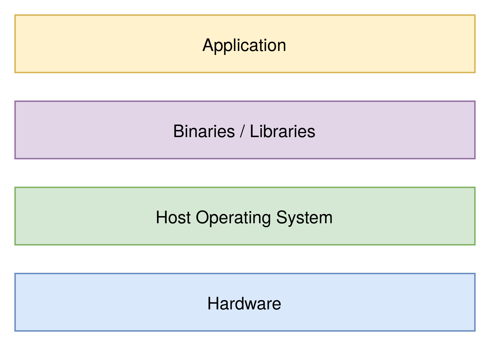

## Agenda

- What was before?
- What is solved?
- Hypervisor Types
- Virtualization vs Para-Virtualization
- Common Steps to Create VMs

---

## What was before?

{ width=75% }

<aside class="notes">
    We have already had a quick introduction to virtual machines so you should
    be familiar with this picture. If you deploy a single application on one
    server you will almost never use the servers full potential.
</aside>

---

## What is solved?

{ width=95% }

<aside class="notes">
    Through virtual machines you are able to save costs by running multiple
    applications isolated from each other on the same server. In case you want
    to add another application you can easily provision a new virtual machine
    and deploy the application on there instead of having to wait for a new
    server or its parts to arrive and then install them in the data center. With
    virtual machines you are in most of the cases operating system independent
    as well. As you can just install any OS within the operating system. We have
    also already covered that part for a bit. But in the previous presentation
    we have not mentioned the existance of two different hypervisor types. As
    you can already see one of them has an additional layer. But lets talk about
    that in a second and first start with the actual proper concept of a virtual
    machine.
</aside>

---

## Concept

- Detach Logical from Physical Resources (Abstraction)
- Define Abstraction
  - Simulation
  - Emulation
  - Virtualization
- Abstraction is Inconsistent (Hybrids occur)

<aside class="notes">
    The idea of virtualizations (the thing virtual machines use) is to detach
    logical from physical resources. This is also know as abstraction. This then
    allows you to use these virtualized logical resources with the help of the
    hypervisor. But this abstraction is not always clearly defined it could
    sometimes be simulation meaning modelling the system but not actually
    having an acutal link to the system nor implementation of it. But it could
    also be emulation where you try to approximatly implement the behaviour of
    the actual system without actually being the system. Finally there is
    virtualization where you approximatly implement the behaviour of the system
    by using parts of its implementation. But be aware that abstraction is not
    always fully defined, precise and that there are some hybrid forms of all
    the three things we just mentioned.
</aside>

---

## Hypervisor Types

{ width=95% }

<aside class="notes">
    There are two types of hypervisors. Lets take a look on how they differ. In
    this image the one on the right is type II the one on the left type I.
</aside>

---

## Type I Hypervisor

- Hardware <-> Hypervisor <-> Guest OS
- Run on Hardware of Host
- Bare Metal Hypervisors
- VMWare ESX(i), Microsoft Hyper-V, ...

<aside class="notes">
    So lets talk about type I hypervisors. Type I hypervisors are what you saw
    on the previous slide on the right side. They run on the actual hardware and
    provide some operating system functionality for the maintainer. These
    hypervisors are known as bare metal hypervisors as they run on the actual
    hardware. If your guest operating system wants do something with the
    hardware it will communicate to your hypervisor and the hypervisor will then
    take care of communicating to the hardware. Some common type I hypervisors
    are VMWare ESX and ESXI and Microsoft Hyper-V. 
</aside>

---

## Type II Hypervisor

- Hardware <-> OS <-> Hypervisor <-> Guest OS
- Run as Software on top of Host OS
- VMWare Workstation, Oracle Virtual Box, ...

<aside class="notes">
    Type I hypervisors are what you saw on the left side of the section slide.
    They run as a software on top of the host operating system and provide an
    interface for the maintainer. If your guest operating system wants to
    communicate to some hardware it will first have to go to the hypervisor. The
    hypervisor will then talk with the help of the host operating system to the
    actual hardware.
</aside>

---

## Full- vs Para- Virtualization

<aside class="notes">
    Another thing realted to virtualization is full vs para virtualization. Lets
    take a look at the differences.
</aside>

---

## Full Virtualization

- Guest OS does not know its Virtualized
- Less Secure
- Slower
- Support all OS

<aside class="notes">
    With full virtualization the guest operating system does not know that it is
    being virtualized. It will directly do some hardware calls if it has to.
    Because of that it is also less secure, isolated and a bit slower as the
    hypervisor has to make sure that the virtual machines dont interfer with
    each other. Through the fact that operating system does not know its
    virtualized all operating systems are supported.
</aside>

---

## Para Virtualization

- Guest OS knows it is Virtualized
- More Secure
- Faster
- Supports only modified OS

<aside class="notes">
    Para virtualization in comparison only works with guest operating systems
    that know that they are being virtualized. These operating systems then
    communicate over one more layer with the hypervisor and inform if they want
    to interact with the hardware. Through that the hypervisor is able to get
    instructions quicker and parallelize them. This leads to the system being
    more secure and faster but has as previously mentioned the drawback that the
    operating system has to be modified.
</aside>

---

## Usual Steps to Create VMs

1. Install an ISO or Image of your OS
2. Within your Hypervisor prepare a VM
   - Choose the resources for your VM
     - CPU
     - RAM
     - Storage
     - ...
   - Choose the ISO as a Boot Medium
3. Install your OS

<aside class="notes">
    In the exercise of today you will work with a type II hypervisor. Usually
    with almost any hypervisor you will have to first download an ISO or Image
    of the operating system you want to install. After that you will have to
    prepare your VM in the hypervisor. You have to do that by choosing the
    resources required like CPU, RAM and storage. Then you will have to tell the
    hypervisior it should start the VM with the ISO or image as the boot medium.
    If this step is reached you can start it and install the OS.
</aside>
