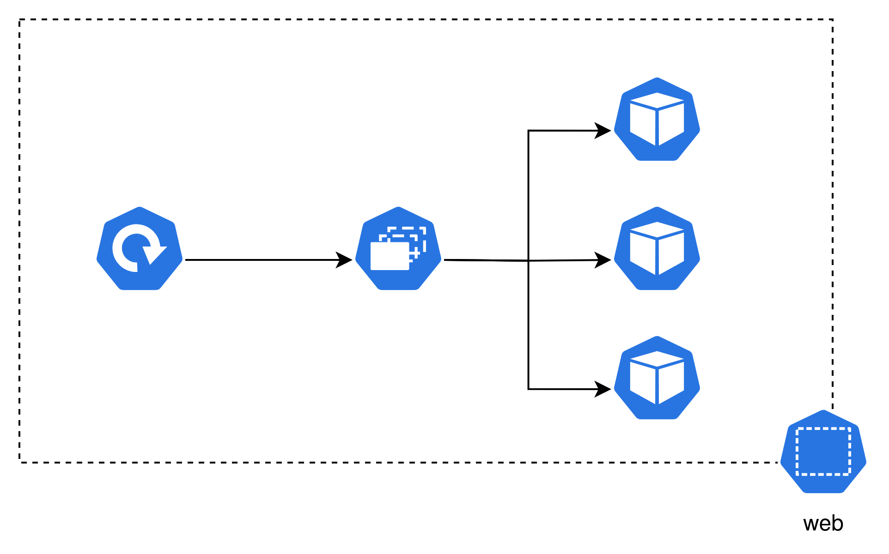

## Agenda

- What is Container Orchestration?
- Kubernetes

---

## What is Container Orchestration

- Orchestration of Container...
  - Provisioning
  - Deploying
  - Scaling
  - Management
- Independent of underlying Infrastructure
- Helps to use Container at Scale
- Turn Current into Target State

<aside class="notes">
    Container orchestration is used to orchestrate the provisioning, deploying,
    scaling and management of containers. Through container orchestration tools
    that can be done independent of the underlying infrastructure - the tool
    will take care of it. These tools are mostly used by big companies that have
    to deploy thousands of containers and somehow keep track of them. But as the
    term or specifically the tool Kubernetes gained a lot of hype over the last
    couple of years smaller projects then to move to Kubernetes as well. The
    thing about container orchestration tools is that they try to turn the
    current state of a system into the desired one. In our case this could be
    creating containers, removing them, increasin their resources and so on.
</aside>

---

## Kubernetes

- Container Orchestration Software
- Open Source
- Developed by Google

<aside class="notes">
    The most known container orchestration software is Kubernetes. It was
    developed from google and used for some years internally. Then they decided
    to opensource it in 2014. It provides many different things that we covered
    in the previous slide like service discovery and load balancing, storage
    orchestration, automated rollouts and rollbacks, resources based
    distribution of containers, self-healing, secret and configuration
    management, batch execution, scaling, IP stack allocations and extensibility
    for more. Lets take a look at the most common terms and how different things
    are defined with YAML.
</aside>

---

## Cluster


<aside class="notes">
    Kubernetes runs on a so called cluster. A cluster is a collection of servers
    also known as nodes. On the image you see an overview on how a cluster looks
    like. You can ignore the components within the nodes for know. It just
    visualizes how they communicate with each other and the containers. There
    are two types of nodes. The ones you see on the right are worker nodes.
    These worker nodes run the containers. In every cluster there is at least
    one worker node. Beside worker nodes you see a single control plane node on
    the left side. The control plane node serve the control plane which then
    manages all the worker nodes and the containers and resources on them.
</aside>

---

## Pod


<aside class="notes">
    Pods are the smallest deployable units of computing that you can create and
    manage in Kubernetes. A Pod is a group of one or more containers, with
    shared storage and network resources, and a specification for how to run the
    containers.
</aside>

---

## Pod Example

```yaml
apiVersion: v1
kind: Pod
metadata:
  name: nginx
  labels:
    app: nginx
spec:
  containers:
    - name: nginx
      image: nginx:1.14.2
      ports:
        - containerPort: 80
```

---

## Replica Set

{ width=50% }

<aside class="notes">
    A ReplicaSet's purpose is to maintain a stable set of replica Pods running
    at any given time. As such, it is often used to guarantee the availability
    of a specified number of identical Pods.
</aside>

---

## Replica Set Example

```yaml
apiVersion: apps/v1
kind: ReplicaSet
metadata:
  name: nginx
  labels:
    app: nginx
spec:
  replicas: 3
  selector:
    matchLabels:
      app: nginx
  template: <POD_EXAMPLE>
```

---

## Deployment


<aside class="notes">
    A Deployment provides declarative updates for Pods and ReplicaSets. You
    describe a desired state in a Deployment, and the Deployment Controller
    changes the actual state to the desired state at a controlled rate. You can
    define Deployments to create new ReplicaSets, or to remove existing
    Deployments and adopt all their resources with new Deployments.
</aside>

---

## Deployment Example

```yaml
apiVersion: apps/v1
kind: Deployment
metadata:
  name: nginx
  labels:
    app: nginx
spec:
  replicas: 3
  selector:
    matchLabels:
      app: nginx
  template: <POD_EXAMPLE>
```

---

## Secret


<aside class="notes">
    A Secret is an object that contains a small amount of sensitive data such as
    a password, a token, or a key. Such information might otherwise be put in a
    Pod specification or in a container image. Using a Secret means that you
    don't need to include confidential data in your application code.
</aside>

---

## Secret Example

```yaml
apiVersion: v1
kind: Secret
metadata:
  name: api-secret
data:
  token: bm90IHNvIHNlY3JldA==
```

```bash
echo -n "bm90IHNvIHNlY3JldA==" | base64 -d
```

```
not so secret
```

---

## Config Map


<aside class="notes">
    A ConfigMap is an API object used to store non-confidential data in
    key-value pairs. Pods can consume ConfigMaps as environment variables,
    command-line arguments, or as configuration files in a volume.
</aside>

---

## Config Map Example

```yaml
apiVersion: v1
kind: ConfigMap
metadata:
  name: api-config
data:
  url: "http://localhost:8080"
```

---

## Service


<aside class="notes">
    In Kubernetes, a Service is a method for exposing a network application that
    is running as one or more Pods in your cluster.
</aside>

---

## Service Example

```yaml
apiVersion: v1
kind: Service
metadata:
  name: web-service
spec:
  selector:
    app: nginx
  ports:
    - protocol: TCP
      port: 80
      targetPort: 80
```

---

## Namespace



<aside class="notes">
    In Kubernetes, namespaces provides a mechanism for isolating groups of
    resources within a single cluster. Names of resources need to be unique
    within a namespace, but not across namespaces. Namespace-based scoping is
    applicable only for namespaced objects (e.g. Deployments, Services, etc) and
    not for cluster-wide objects (e.g. StorageClass, Nodes, PersistentVolumes,
    etc).
</aside>

---

## Namespace Example

```yaml
apiVersion: v1
kind: Namespace
metadata:
  name: web
```

---

## To be Continued

- StatefulSet
- Quotas
- Limits
- Ingress
- NetworkPolicy
- HPA and VPA
- PV and PVC
- Operators
- ...

<aside class="notes">
    There are so many more resources in Kubernetes that we could cover in this
    presentation but for now you should have a basic knowlegde on what
    Kubernetes is. Some common resources in Kubernetes and ones you could learn
    about. With this knowlegde you should be able to proceed with the exercise.
</aside>
