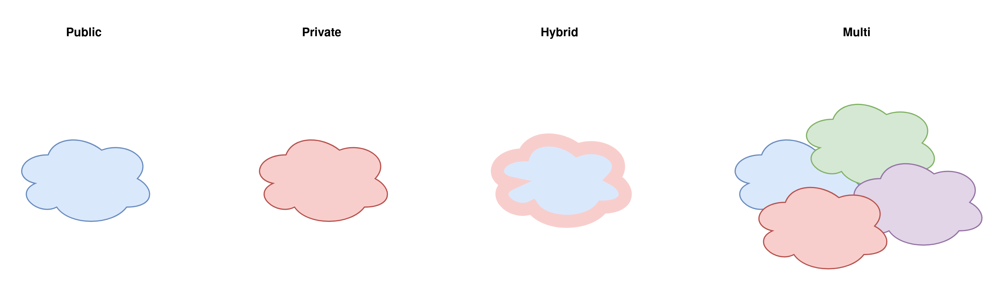
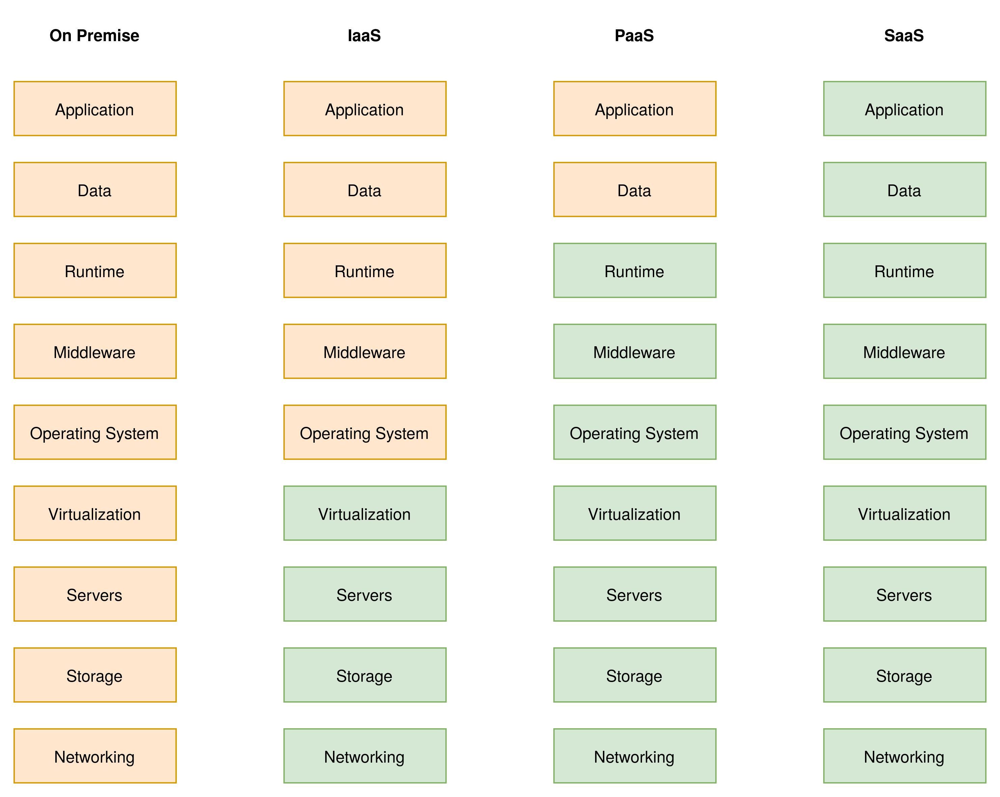

## Agenda

- What is Cloud Computing?
- Types
- Models
- Common Services
- Providers

---

## What is Cloud Computing?

- On Demand delivery of IT resources
- Rent instead of Buy
- Pay as you go
- Agile, Elastic, Cheap, Global
- Privacy, Vendor Lock-In, Costs

---

## Types

---

## Models

{ width=75% }

---

## Common Services

- Compute
- Storage
- DevOps Tools
- Database
- Networking
- Analytics
- Machine Learning
- Security

---

## Providers

- Amazon Web Services (AWS)
- Microsoft Azure
- Google Cloud Provider (GCP)
- Alibaba Cloud
- Exoscale
- ...
