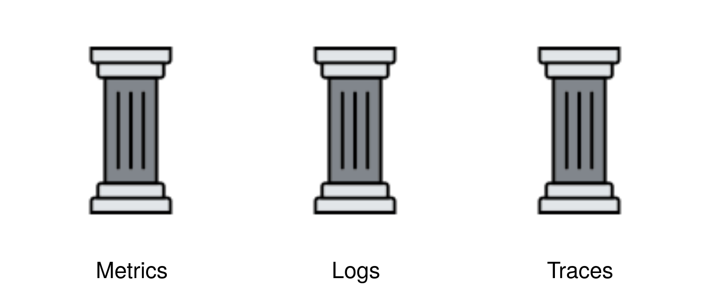

## Agenda

- What is Observability
- Three Pillars of Observability
- Metrics
- Logs
- Traces

---

## What is Observability?

- Measure State of a System through Data
- Gain insights to complex Systems
- Learn about unknown Problems

---

## Three Pillars of Observability



---

## Metrics

- Counters or Measurements
- Aggregated over a Time Period
- Different Sources
  - Infrastructure
  - Hosts
  - Services
- Key Performance Indicators

---

## Metrics Example

- CPU Usage
- Memory Usage
- Request per Minute
- Latency
- Error Rates
- ...

---

## Logs

- Discreet Events
- Structured or Unstructured Text
- Specific Time

---

## Logs Example

```
{"time":1702489921,"level":"INFO","message":"started application server"}
{"time":1702489922,"level":"INFO","message":"handling request","method":"GET","path":"/greet","status_code":200}
{"time":1702489922,"level":"INFO","message":"handling request","method":"GET","path":"/greet?name=zhews","status_code":200}
{"time":1702489922,"level":"INFO","message":"handling request","method":"GET","path":"/greet","status_code":200}
{"time":1702489922,"level":"INFO","message":"stopping application server"}
```

---

## Traces

- Observing Requests
- Flow through different Components
- Detect Bottlenecks
- Creates a unique Identifier
- Passes it to all Transactions

---

## Traces Example


