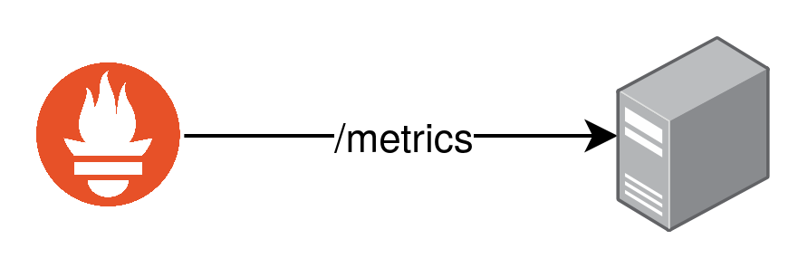
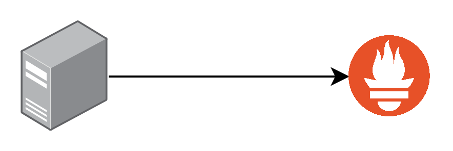

## Agenda

- What is Prometheus?
- Metric Types
- Queries

---

## What is Prometheus?

- Monitoring Solution
- Originally built by SoundCloud
- Time Series
- Allows Queries
- Used for Visualization
- Pull or Push Approach

---

## Pulling Metrics



---

## Pushing Metrics



---

## Metric Types

---

## Counter

- Number that can only be Increased
- Reset to Zero is Possible
- Examples
  - Number of Requests
  - Errors
  - ...

---

## Gauge

- Number that can go Up and Down
- Mostly used for Measurements
- Can also be used for counts that in- and decrease
- Examples
  - Temperatures
  - Concurrent Requests
  - ...

---

## Histogram

- Count of a specific Observation
- Provides a Sum of all Observations
- Examples
  - Request Durations
  - Response Sizes

---

## Summary

- Same as Histogram
- Provides configurable Quantiles over Time Windows
- Examples
  - Request Durations
  - Response Sizes

---

## Queries

---

## PromQL

- Prometheus Query Language
- Functional Query Language
- Select and Aggregate Data in Realtime
- Used to
  - Create Graphs
  - Tables
  - Processing
  - ...

---

## Example Queries

```
http_requests_total
http_requests_total{job="api", handler="/api/comments"}
http_requests_total{job="api", handler="/api/comments"}[5m]
http_requests_total{job=~"api_(0|1)"}
```
