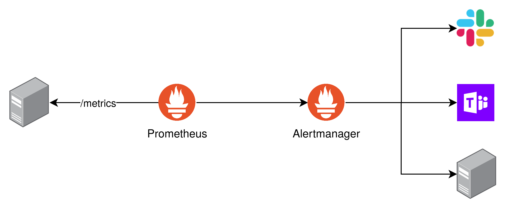

## Agenda

- What is the Alertmanager?
- Prometheus Rules
- Receivers
- Routes

---

## What is Alertmanager

- Handler for Alert sent by Client Application
- Does the grouping, deduplication and routing
- Different Receiver Integrations
- Based on Rules
- Can silence and inhibit Alerts

---

## Alertmanager Overview



---

## Prometheus Rules

- Conditions that trigger an Alert
- Based on PromQL

---

## Prometheus Rule Example

```yaml
groups:
  - name: "Greetings"
    rules:
      - alert: "GenericOverSpecific"
        expr: "sum(increase(example_total[1m])) > 5"
```

---

## Receivers

- SMTP
- Slack
- Telegram
- HTTP
- ...

---

## Routes

- Where to Send which Alert
- Defines Matching and Grouping
- Specific Time Intervals
- Defines the Receiver
